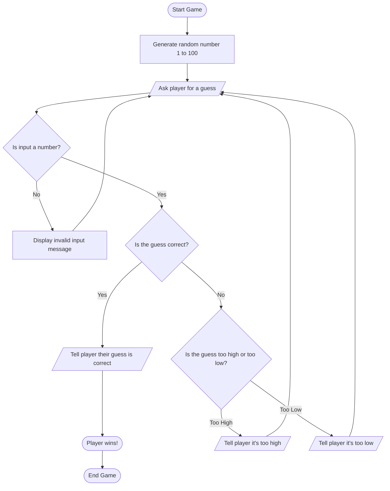

1. **Start Game (A)**: 
   - The game begins, initializing the number guessing process.

2. **Generate random number (B)**: 
   - The computer generates a random number between 1 and 100, which the player must guess.

3. **Ask player for a guess (C)**: 
   - The game prompts the player to input their guess for the random number.

4. **Check if input is a number (J)**: 
   - The game checks if the player’s input is a valid number:
     - **If the input is not a number**: The game displays an "Invalid input" message (K) and prompts the player to guess again.
     - **If the input is a number**: The game proceeds to check the guess.

5. **Is the guess correct? (D)**:
   - The game checks whether the player's guess matches the random number:
     - **If the guess is correct**: The game proceeds to tell the player their guess is correct (L) and the player wins (E).
     - **If the guess is incorrect**: The game checks whether the guess is too high or too low (F).

6. **Is the guess too high or too low? (F)**:
   - The game evaluates whether the guess is higher or lower than the random number:
     - **If the guess is too high**: The game informs the player that their guess is too high (G) and prompts them to guess again.
     - **If the guess is too low**: The game informs the player that their guess is too low (H) and prompts them to guess again.

7. **Player wins! (E)**:
   - If the player guesses the correct number, the game congratulates the player and ends.

8. **End Game (I)**:
   - The game terminates after the player wins, concluding the number guessing game.
